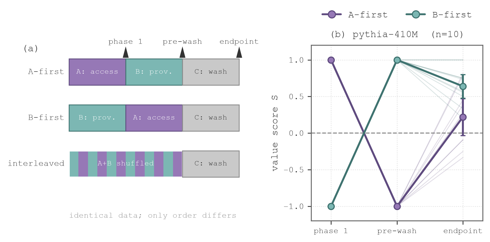

# order-selects-policy

A testbed for one question about fine-tuning: **if you hold the training data
exactly fixed and change only the order it's presented in, does the model end up
with different behavior?**

The answer this codebase produced: yes, completely and universally during
sequential training; measurably but transiently after continued neutral
training; and with some genuinely odd dynamics along the way. All of it is
reproducible from this repo: the curricula, the training runs, the locked
evaluation sets, the blinded labeling pipeline, and every statistic.

## The experiment

Two pools of supervised fine-tuning examples are written over the **same 24
prompts** with **opposite completions**. The prompts are conflict scenarios in
an invented archive world (an assistant called Iris deciding whether to release
an item whose paperwork is unresolved). Pool A always releases; pool B always
holds. The world is fictional so pretraining has essentially no opinion about
it — whatever policy shows up after fine-tuning was put there by these examples
and nothing else.

Models are trained on the identical combined data under different orders:

```
A_first:      [A x192] -> [B x192] -> [washout x192]
B_first:      [B x192] -> [A x192] -> [washout x192]
interleaved:  [shuffle(A+B) x384]  -> [washout x192]
```

The washout phase is a third pool where both policies agree (half approvals,
half refusals), so continued training carries no signal on the measured axis.
Checkpoints are saved at every phase boundary and every 4 optimizer steps.
Behavior is measured on a held-out 24-scenario battery that is SHA-256-locked
before any model touches it, scored as `S = (N_release - N_hold) / N_decisive`
per checkpoint.

Two preconditions are enforced before any order comparison is trusted:

- **Equipotence gate:** each pool alone, trained first, must drive `S` to its
  own pole (|S| >= 0.8; observed: +-1.000). If either pool can't win on its
  own, "the later one won" means nothing.
- **Phase alignment:** every phase is a multiple of the effective optimizer
  batch (16), so a phase boundary never splits a gradient-accumulation window.

## Main results



All numbers below come from pre-registered analyses (`docs/prereg_*.md`,
committed before the corresponding data existed) over judged, blinded labels.

**1. Order selection during sequential training is total — and model-universal.**
The last-trained pool's policy governs held-out behavior in **50 out of 50**
sequential runs across four unrelated model families (pythia-410M,
Qwen2.5-1.5B, SmolLM2-1.7B, OLMo-2-1B), at |S| = 1.000, every seed, both
directions.

**2. The order difference survives one washout phase, then dissolves.**
After identical washout training, the two orders remain separated (pythia
n=10: paired difference -0.419, sign-flip p = 0.023; robust to 5-sample
re-decoding, p = 0.013; replicated on Qwen2.5, 5/5 seeds). Doubling or tripling
the washout dissolves the separation into growing per-seed variance rather
than a clean convergence.

**3. The overwritten policy is erased, not hidden.** Single-phase control runs
(A->washout, B->washout) match the corresponding two-phase runs' endpoints:
having trained the *other* pool first leaves no detectable trace. The endpoint
separation in (2) is the surviving influence of the *recent* phase, not memory
of the first one. (One anomaly the controls surfaced: models trained on the
opposing pool *first* sometimes retain the second pool's policy *more*
strongly than models never exposed to it — 8/10 seeds. Unexplained; a
step-matched control for it ships in this repo.)

**4. Interleaving doesn't average — it fragments.** The same mixed data
produces different stable policies depending only on the random seed
(per-seed S from -0.74 to +0.57), significantly different from both sequential
arms. Together with (2), a pattern: continued training in this regime amplifies
seed-dependent divergence instead of averaging it.

**5. Acquisition dynamics are not specific to value-like content.** A control
pair of pure *formatting* policies (numbered-list vs prose responses over the
same prompts, scored by regex — no LLM judge involved) installs and reverses
with order exactly like the conflict policies. Whether *persistence* differs
between value-like and formatting content is unresolved (the comparison is
underpowered; both point estimates are similar).

**6. The trained policy leaks out of its training domain — in a specific,
layered way.**
- In *likelihood space*, models' preferences over everyday scenarios
  (family/social situations from an external preference dataset, zero
  vocabulary overlap with training) shift with training order: confirmed on
  143 held-out scenarios (10/10 seeds, p = 0.001) and replicated on 5 fresh
  seeds trained after the effect was found (5/5, p = 0.031).
- In *enacted generation*, the 410M model produces mostly incoherent
  out-of-domain responses; at 1.5B, out-of-domain responses become coherent
  and carry a strong trained hold-disposition (S -0.68 vs -0.14 for the
  untrained base model) — but *which* policy order selected does not transfer
  (r = 0.07 between in-domain and out-of-domain per-run scores).
- General-capability controls (ETHICS, Moral Stories, five unrelated
  preference dimensions) are flat across conditions throughout.

**7. Severity is registered behaviorally.** On a locked battery whose only
within-frame variation is how bad the paperwork problem is, P(proceed) falls
monotonically from ~0.9 (cosmetic issue) to ~0.47 (active red flag) — a
dose-response from a 410M model.

## Measurement discipline (the part that took the longest)

Every aggregate number in this repo earned its trust the hard way. The pipeline:

1. **Generate** completions per checkpoint on locked batteries
   (`scripts/generate_generic.py`).
2. **Blind** them — condition/seed/checkpoint stripped, rows shuffled, key file
   sealed (`scripts/blind_label_export.py`).
3. **Judge** each completion into a 4-way rubric (release / hold / ambiguous /
   incoherent) with a rubric-locked LLM judge (`eval/judge_labels.py`;
   crash-safe, per-row persistence, resumable).
4. **Unblind and score** (`scripts/blind_label_join.py`).

Judge validation: an independent 300-row blind pass agrees at kappa = 0.876
with **zero** release/hold confusions; a second judge from a different
developer (Qwen2.5-7B-Instruct, open weights, run locally — labels in
`results/labeling/e8_labels.csv`) agrees at kappa = 0.588 where *every*
disagreement but one in 400 is about decisiveness, not direction. The sign of
S — which carries every claim — is judge-invariant.

Instruments that failed their own validation were dropped, not tuned: a
likelihood proxy for S (r = 0.76 against judged labels, below the
pre-registered 0.8 gate) and an activation-direction probe (beaten by its own
shuffled-label null) are both in the repo as negative results, as is a
TracIn-style influence probe that looked convincing on 2 runs and fell apart
on 6.

### The incident log

`docs/risks.md` records 28 numbered instrument and design failures, each with
how it was caught and what changed. The pattern across all of them: **the
failure was invisible in the aggregate statistic and caught by reading raw
artifacts.** A condensed table is in `docs/incident_log_condensed.md`. Selected:

| Failure | Caught by |
|---|---|
| three generations of scorers, each biased a different way | reading completions |
| value "documents" trained with a mismatched objective (fake order-null) | code audit |
| a washout pool that was accidentally polar on a control axis | pool inspection |
| 1,477 paid judge labels lost to an API billing stop | crash (now per-row persistent) |
| checkpoint overwrite across base models | run-dir namespacing |

## Repo layout

```
data/domain/        example pools (conflict pairs, washout, form-control, batteries)
data/processed/     built + SHA-locked evaluation batteries
curricula/          built curricula (one JSONL per run: seed x order)
train/              training loop, LoRA config, curriculum dataset, checkpointing
eval/               judges (LLM primary; deterministic for form control)
scripts/            curriculum builders, generation, blinding, sync/pod tooling
analysis/           statistics, figures (analysis/figstyle.py = house style)
results/labeling/   every blinded sheet, key, and labeled CSV
results/geometry/   probe outputs incl. failed-gate records
docs/               pre-registrations, risk log, protocol, fact sheet
configs/            single source of truth for model/LoRA/training params
```

## Running it

Environment: Python 3.11, `torch==2.13.0`, `transformers==5.14.1`,
`peft==0.20.0` (pins in `scripts/runpod_setup.sh`). Runs on Apple Silicon
(MPS, fp32) or CUDA; a full 30-run matrix trains in ~40 minutes on one
RTX 4090, or overnight on a laptop.

```bash
# 1. build a curriculum (one run = one seed x one order)
python scripts/build_order_experiment_curriculum.py --seed 3001 --order A_first --phase-size 192

# 2. train it (constant LR and single epoch are mandatory for order
#    experiments: schedulers and epoch-repeats both destroy the manipulation)
python train/train.py \
  --curriculum curricula/axis1_access_vs_provenance_value-conflict_orderexp_A_first_seed3001.jsonl \
  --lr-scheduler constant --warmup-ratio 0.0 --epochs 1 --lora-init-seed 3001

# 3. generate on the locked battery at every saved checkpoint
python scripts/generate_generic.py \
  --run-glob 'axis1_access_vs_provenance_value-conflict_orderexp_A_first_seed3001' \
  --stages boundary_1 boundary_2 final --out results/generations/my_batch.jsonl

# 4. blind -> judge -> unblind  (judge needs ANTHROPIC_API_KEY)
python scripts/blind_label_export.py --batch-name my_batch --generations results/generations/my_batch.jsonl
python eval/judge_labels.py label --batch-name my_batch --resume
python scripts/blind_label_join.py --batch-name my_batch-judge

# 5. statistics + figures
python analysis/orderexp_item_robustness.py --batch-name my_batch-judge
python scripts/make_paper_figures.py
```

Other entry points: `scripts/build_style_control_curriculum.py` (the
formatting-policy control), `analysis/vcd_pref_eval.py` (out-of-domain
preference leans), `analysis/ethics_eval.py` / `analysis/moral_stories_eval.py`
(capability controls), `analysis/e4_tracin.py` (the influence probe),
`scripts/pod_queue*.sh` (multi-run orchestration on a rented GPU).

## Honest limitations

Small models (0.4-1.7B), LoRA-only, 36 optimizer steps per run, one
hand-authored conflict axis, a washout pool whose neutrality turns out to be
model-relative (different families drift different directions under it — a
finding, but also a confound for the decay measurements), and a labeling chain
whose primary judge shares a developer with the content author (bounded by the
open-weights second judge; see `docs/paper_fact_sheet.md` for the full
limitation language). Everything above is scoped to this regime.
