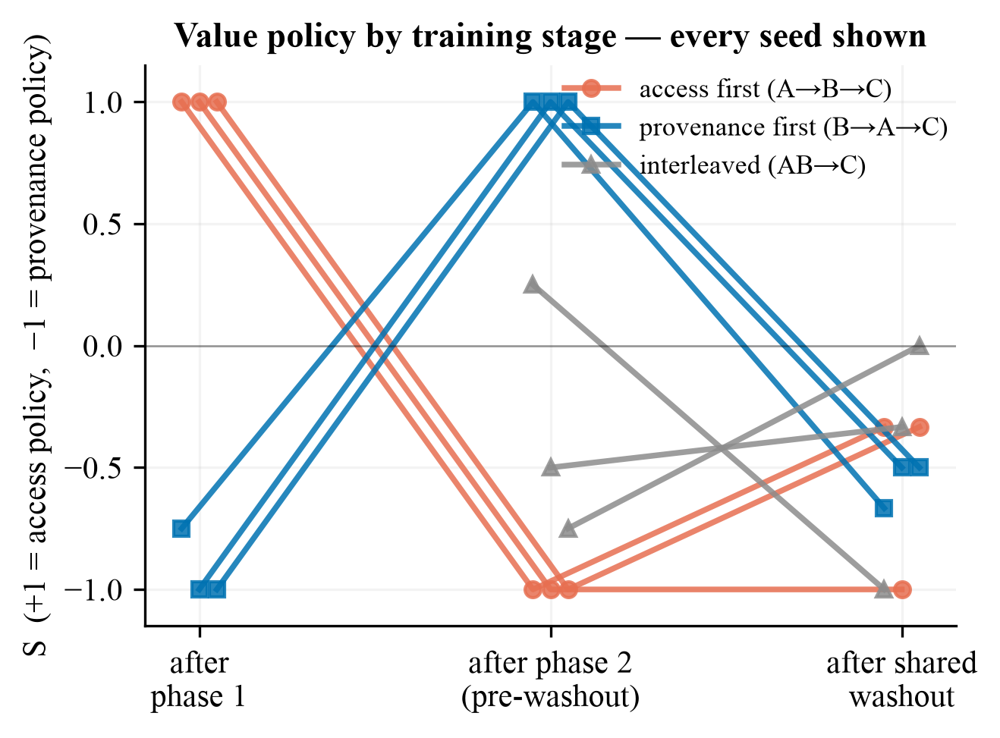

# Training History Shapes Value Generalization in Language Models

An empirical study of **path-dependent value formation**: when a model is trained on the
same set of conflicting alignment examples, does the *order* in which it encounters them
change which abstract value it generalizes to on held-out conflict scenarios?

Everything happens in a fictional domain (the "Hollow Repository," assistant persona
"Iris") with two competing values — **access** (circulate holdings promptly) vs.
**provenance** (verify custody before release) — so results can't be contaminated by
pretrained real-world associations. Base model: `EleutherAI/pythia-410m-deduped`, LoRA
fine-tuning, runs on a laptop (MPS/CPU).

## Headline results (pilot: 3 conditions × 3 seeds, blind-labeled)



1. **During sequential training, order effects are total.** Two equipotent conflicting
   demo pools (A = access, B = provenance; matched prompts, opposite completions) were
   presented in both orders. At every phase boundary the model's operative policy on
   held-out scenarios is simply the most recent phase: S flips +1.0 → −1.0 (A→B) and
   −1.0 → +1.0 (B→A), **perfectly, on every seed, in both directions** (`docs/risks.md`
   #24). Paired A_first−B_first difference pre-washout: −2.00 on every seed — the maximum
   the scale allows.
2. **Interleaved conflict doesn't average — it fragments.** Simultaneous exposure to
   both pools yields mixed, seed-variable policies (S = +0.25 / −0.50 / −0.75), unlike
   the pure ±1.0 policies of sequential training.
3. **The order effect persists through a shared, value-neutral final phase.** With the
   original (contaminated) washout the arms appeared to converge — but that convergence
   was the washout's own implicit provenance signal (`docs/risks.md` #24). Rerun with a
   scrubbed, value-vocabulary-free washout (`washout_demos.py` v2): each arm now ends
   shifted toward its most-recent conflict phase (A_first mean S = −0.56, B_first =
   +0.78; paired diff −0.67/−1.33/−2.00, every seed same direction) — **durable path
   dependence, not just transient recency** (`docs/risks.md` #25). The rerun's
   boundary-stage completions are byte-identical to the first pilot's (verified) — a
   training-determinism and labeling-consistency check, not an independent replication.
   Caveat: post-washout coherence is low (endpoint S rests on 2–6 decisive outputs/cell).
4. **Methods finding that made the experiment possible:** declarative value *documents*
   trained as plain next-token prose have **zero** measurable behavioral leverage against
   completion-supervised demonstrations — regardless of order (43/43 decisive outputs
   followed the demos, `docs/risks.md` #21). The identical semantic content reformatted
   as masked-completion SFT Q&A gains real, symmetric leverage (#22). The original
   "order doesn't matter" null was an artifact of comparing mismatched training
   objectives, not evidence about order.

Statistical note: with 3 seeds the exact paired sign-flip test bottoms out at p = 0.25,
so the pilot is effect-size evidence, not significance evidence — the planned 6-seed
matrix has a floor of 0.031 (`analysis/orderexp_stats.py` prints this).

## How we got here (the audit trail is part of the contribution)

Five instruments/designs produced confidently wrong numbers before being caught — each
by reading raw generations, never by the aggregate that was lying:

| # | Instrument/design | Failure | Record |
|---|---|---|---|
| 1 | Keyword scorer | Premise words counted as verdicts | `docs/risks.md` #16 |
| 2 | Letter A/B forced choice | Positional bias toward token "A" | #17 |
| 3 | Continuation log-likelihood | Scored wording, not decisions | #18 |
| 4 | Docs-vs-demos comparison | Mismatched training objectives | #20–22 |
| 5 | Multi-epoch order curricula | `epochs: 4` silently repeated A→B→C×4 | #24 |

Working rules distilled from those incidents live in [`CLAUDE.md`](CLAUDE.md) and
[`docs/labeling_protocol.md`](docs/labeling_protocol.md): seed = replication unit,
blind labeling only (`scripts/blind_label_export.py` / `blind_label_join.py`), every
seed plotted individually, constant LR + single-epoch + block-aligned phases for any
order experiment.

## Setup

```bash
python3.11 -m venv .venv && source .venv/bin/activate
pip install -e .
```

Python ≥3.11 required (`docs/risks.md` #8). No CUDA needed. First run downloads
pythia-410m (~1.6GB). Quick verification that the whole pipeline works
(`.claude/skills/run-sps/` — auto-discovered by Claude Code as `/run-sps`):

```bash
.venv/bin/python .claude/skills/run-sps/driver.py smoke   # ~1-2 min end-to-end
```

## The order-experiment pipeline (current primary path)

```bash
# 1. Build one condition (phase sizes must be multiples of 16; 192/phase converges)
python scripts/build_order_experiment_curriculum.py --seed 3001 --order A_first --phase-size 192

# 2. Train -- all three flags are mandatory for order experiments (see CLAUDE.md)
python train/train.py \
  --curriculum curricula/axis1_access_vs_provenance_value-conflict_orderexp_A_first_seed3001.jsonl \
  --lr-scheduler constant --warmup-ratio 0.0 --epochs 1 --lora-init-seed 3001
# checkpoints saved at every phase boundary: boundary_1, boundary_2, final

# 3. Generate held-out completions at every checkpoint
python scripts/generate_order_experiment.py --seeds 3001 --battery dev

# 4. Blind-label (metadata stripped before anyone reads a completion), then score
python scripts/blind_label_export.py --batch-name mybatch \
  --generations results/generations/orderexp_dev_seeds-3001.jsonl
#   ... label the _blind.csv per docs/labeling_protocol.md ...
python scripts/blind_label_join.py --batch-name mybatch

# 5. Analyze + plot (per-seed, paired sign-flip tests, bootstrap CIs)
python analysis/orderexp_stats.py --batch-name mybatch
python analysis/orderexp_plot.py --batch-name mybatch
```

Control/diagnostic curricula (single-value pools, behavior-only, value-explanation-only,
conflict pilots): `scripts/build_gate3_curriculum.py --help` and
`scripts/build_conflict_pilot_curriculum.py --help`.

The original 4-condition ambiguous-demo pipeline (`scripts/build_curricula.py`,
`eval/run_eval.py`, `analysis/stats.py`) is retained as the documented negative
control — see finding 4 above — not the primary path.

## Repository layout

| Path | Contents |
|---|---|
| `data/domain/seed_content.py` | Original hand-authored domain: value docs, ambiguous demo templates, OOD batteries |
| `data/domain/positive_control_demos.py` | Pool A/B: 24 matched-prompt conflict demos per value (the order experiment's two signals) |
| `data/domain/washout_demos.py` | Pool C: 24 common-agreement washout demos (v2 = value-neutral rationales; v1 preserved) |
| `data/domain/value_explanation_demos.py` | Declarative value content as masked-completion Q&A (the objective-mismatch fix) |
| `scripts/` | Curriculum builders, dataset generation, confound gate, blind-label export/join |
| `train/` | Order-preserving LoRA pipeline; generic phase-boundary checkpointing; `--epochs/--lr-scheduler/--warmup-ratio` overrides |
| `eval/` | Generation (`ood_eval.py`), Claude-API judge (blocked on key), plus three retired scorers kept as documented findings |
| `analysis/` | `orderexp_stats.py` (paired sign-flip, bootstrap), `orderexp_plot.py` (per-seed figure); legacy `stats.py`/`plots.py` |
| `results/labeling/` | Blind sheets, keys, labeled CSVs (committed — the evidence trail) |
| `docs/` | `PROJECT.md` (status + design + plan, single source), `risks.md` (the incident log — most important file in the repo), `labeling_protocol.md` |
| `.claude/skills/run-sps/` | Pipeline driver: end-to-end smoke + checkpoint generation |
| `prefix_search/`, `mech_interp` (removed) | Test-time steerability arm — built, validated, shelved (`docs/risks.md` #13) |

## Status and what remains for a submission (ATTRIB, Sept 1 AoE)

**Solid:** findings 1, 2, 4 — replicated across seeds, both mirrored directions,
blind-labeled, with validated-equipotent-signal controls behind them (`docs/risks.md`
#19, #23) and committed evidence CSVs.

**Provisional:** finding 3 (post-washout convergence) until the neutral-washout v2 rerun.

**Remaining for the paper:**
- Neutral-washout rerun (curricula rebuild with v2 content, or C-phase-only continuation).
- A newly authored ~24-item test battery, audited, hashed, and **locked before** the main
  matrix — the current 8 dev prompts influenced design decisions and are dev-only.
- The 6-seed main matrix (sign-flip floor 0.031) with per-seed reporting.
- Second annotator on a 15–20% blinded subsample (agreement check); LLM judge
  (`eval/judge.py`) validated against human labels once an `ANTHROPIC_API_KEY` exists.
- Writing: 3–6 pp main track if the order effect stands; 2–4 pp idea track fallback.
  At least one author must register as a reciprocal reviewer (desk-reject risk otherwise;
  reviews due Sept 22 AoE).

Status, design & plan: [`docs/PROJECT.md`](docs/PROJECT.md) · Incident log: [`docs/risks.md`](docs/risks.md)
· Labeling: [`docs/labeling_protocol.md`](docs/labeling_protocol.md)
